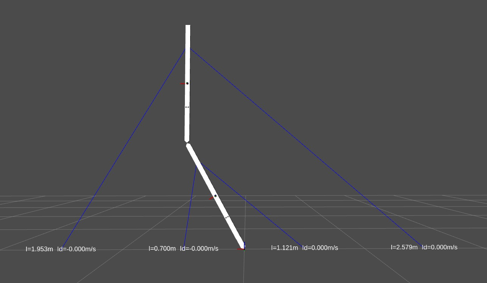

******************
Working with CASPR
******************

**CARDSflow** supports visualization of robots in `CASPR`_ (*The Cable-robot Analysis and Simulation Platform for Research*), an open-source software platform developed in MATLAB for the analysis of arbitrary cable-robot models.

.. _CASPR: https://github.com/darwinlau/CASPR

---------
ROS matlab custom message support
---------------------------------

You need to install custom message support for matlab `MATLABROS`_

.. _MATLABROS: https://de.mathworks.com/help/robotics/ug/install-robotics-system-toolbox-support-packages.html

Setting up CASPR
----------------
1. Follow the installation guide in `CASPR`_
2. After having CASPR installed in MATLAB, note the IPs of your platforms running CARDSflow and CASPR
3. Set up the CARDSflow interface in CASPR by: *(replace <cardsflow_ip>, <caspr_ip> with the corresponding IPs)* ::

    CARDSFlow_configuration.SetROSConfig('<cardsflow_ip>', '<caspr_ip>');
4. Build custom ROS messages in `roboy_communication`_ for MATLAB by following instructions `here`_

.. _roboy_communication: https://github.com/Roboy/roboy_communication
.. _here: https://www.mathworks.com/help/robotics/ug/ros-custom-message-support.html

Simple Visualization
--------------------
Launching CARDSflow
~~~~~~~~~~~~~~~~~~~
1. Launch a simple visualizer in CARDSflow by::

    roslaunch cardsflow_rviz simple_visualization.launch
2. Add the CARDSflow panel in RViz
3. At the Displays Sidebar set Globals Options > Fixed Frame to "world"
4. At the Displays Sidebar add the display types "rviz > Marker" and "rviz > TF"
5. File > Save Config

CASPR Simulation
~~~~~~~~~~~~~~~~
1. Launch the GUI in CASPR by::

    CASPR_GUI
2. Select ``Example 2R planar XZ`` from the ``Model`` pull down menu
3. Click the ``Kinematics`` button in ``Simulators``
4. Click the ``Create Script`` button to generate a script for inverse kinematics simulation
5. Add this line at the end of the script to visualize the simulation result in RViz::

    MotionSimulatorBase.plotCARDSFlow(modelObj, sim.trajectory);

